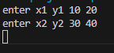
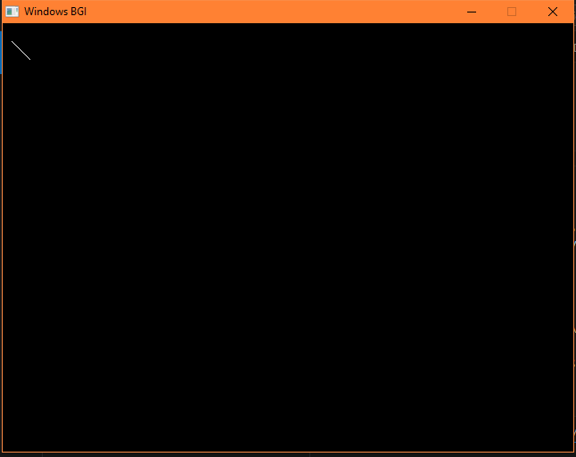

DDA Algorithm:
1. Start
2. Declare x1, y1, x2, y2, dx, step as integer variable and x, y, xinc, yinc as floating
point.
3. Enter value of x1, y1, x2, y2
4. Calculate dx = x2 – x1
5. Calculate dx = y2 – y1
6. If |dx| > |dy|
Then, step = |dx|
Else, step = |dy|
7. xinc = dx /step
yinc = dy / step
assign x = x1
assign y = y1
8. Set pixel (x1, y1)
9. x = x + xinc
y = y + yinc
Set pixel (x, y) (rounded value)
10. Reeat until x = x2
11. End

INPUT:

OUTPUT:

