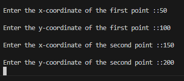
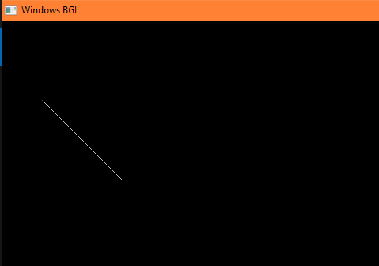

Algorithm of BLA:

For |m| <=1
i. Read xₐ, yₐ, xb
, yb
(Assume −1 ≤ m ≤ 1)
ii. Load (x₀, y₀) into the frame buffer (i.e., plot the first point)
iii. Calculate constants Δy, Δx, 2Δy and 2Δy − 2Δx
Obtain the first decision parameter p₀ = 2Δy − Δx
iv. At each xₖ along the line starting at k = 0 perform the following tests:
If pₖ < 0, then the next point to plot is (xₖ + 1, yₖ) and
pₖ₊₁ = pₖ + 2Δy
Else the next point to plot is (xₖ + 1, yₖ + 1) and
pₖ₊₁ = pₖ + 2Δy − 2Δx
v. Repeat step iv Δx times

INPUT:

OUTPUT:

Conclusion:
In this experiment, Bresenham’s Line Algorithm was successfully implemented to draw a straight line between two given points on a raster display. The algorithm efficiently determines the intermediate pixel positions using only integer calculations, avoiding floating-point operations. This makes it highly suitable for real-time graphics applications.
