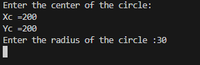
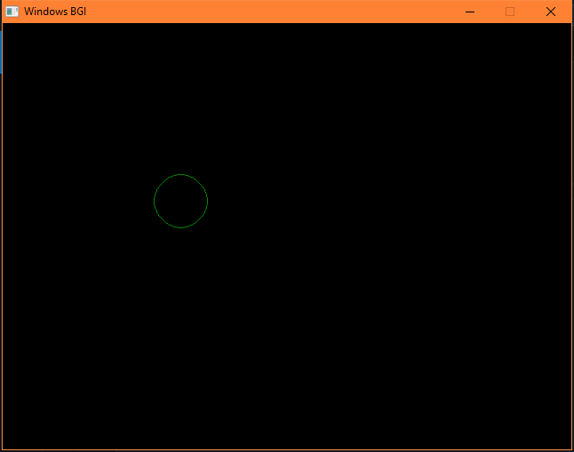

INPUT:

OUTPUT:

CONCLUSION:

In this experiment, the Midpoint Circle Algorithm was studied and implemented to generate a circle efficiently in computer graphics. The algorithm successfully plotted all the points of a circle using only integer arithmetic, avoiding costly floating-point calculations. By exploiting the symmetry of a circle, it reduced computational effort by calculating points for only one octant and reflecting them across the remaining octants.

