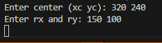
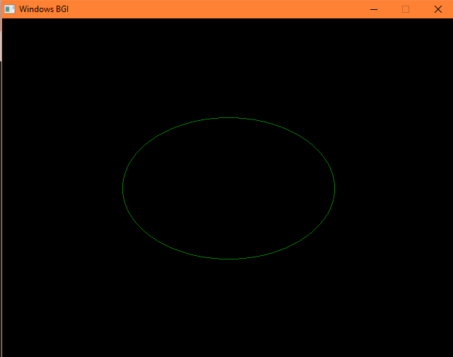

INPUT:

OUTPUT:

CONCLUSION:

In this experiment, the Midpoint Ellipse Drawing Algorithm was successfully implemented to generate an ellipse using fundamental raster graphics techniques. The algorithm efficiently determines the ellipse points by evaluating a decision parameter and exploiting the symmetry of the ellipse about both axes, thereby reducing computational complexity. By dividing the plotting process into two regions, the algorithm ensures accurate pixel selection without using trigonometric functions or floating-point intensive calculations. The graphical output obtained verifies the correctness and efficiency of the algorithm, making it well-suited for real-time rendering in raster display systems. Thus, the midpoint ellipse algorithm proves to be an effective and reliable method for drawing ellipses in computer graphics applications.