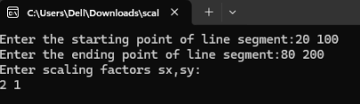
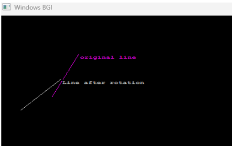
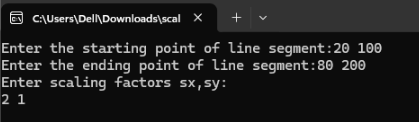
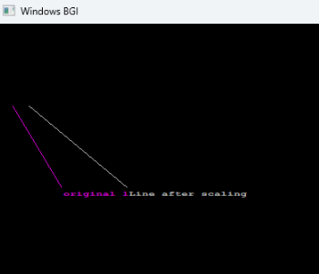
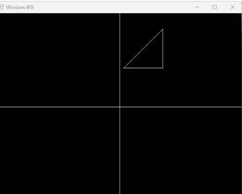
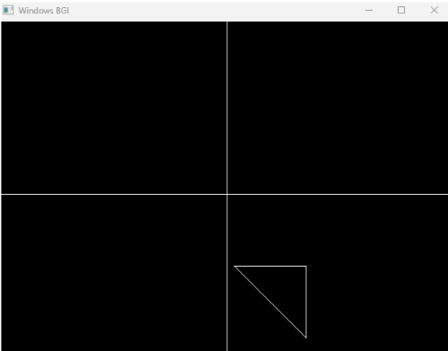
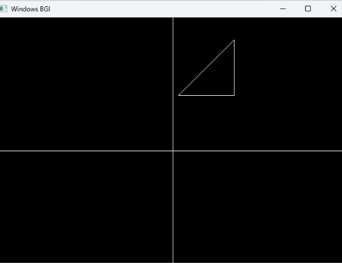
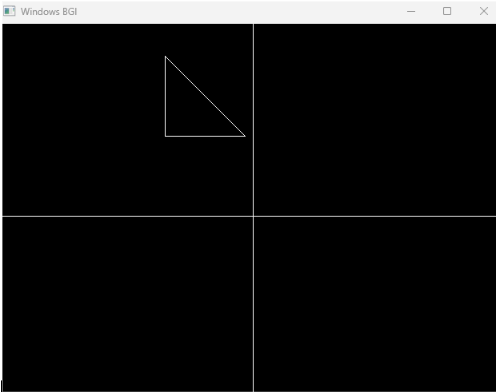

# INPUT AND OUTPUT

1.Translation:

Input:

output:

2.Rotation:

Input:

Output:

3.Scaling:

Input:

Output:

4.Reflection through x:

Before reflection:

After reflection:

5.Reflection through y:

Before reflection:

After reflection:

# CONCLUSION:
In this lab, various 2D transformation techniques such as translation, rotation, scaling, and reflection were successfully implemented and analyzed. The results showed that transformations play a vital role in computer graphics for object manipulation, animation, and visualization. Through this lab, we gained practical understanding of coordinate transformation concepts and their importance in designing graphical applications.

