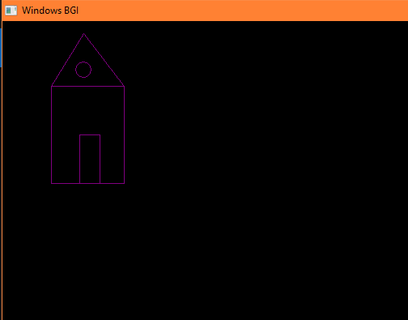
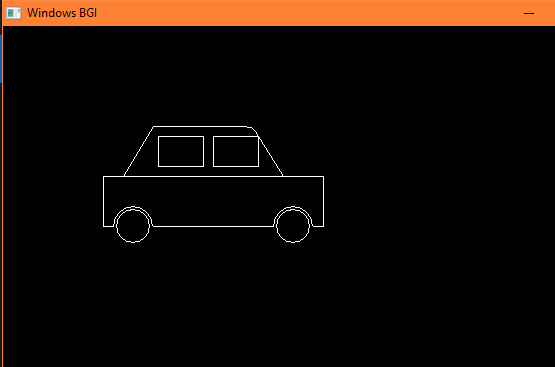

house output:

car output:

CONCLUSION:

In this lab experiment, 2D objects including a house and a car were successfully rendered using the C++ Graphics Library (BGI). The project demonstrated that complex graphical structures are fundamentally composed of basic geometric primitives. By systematically implementing functions such as line(), rectangle(), circle(), arc(), and ellipse(), it was possible to construct detailed representations by calculating specific $(x, y)$ coordinate points on a Cartesian-style grid.