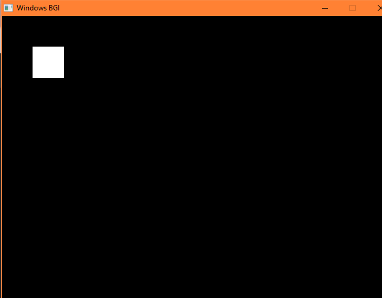
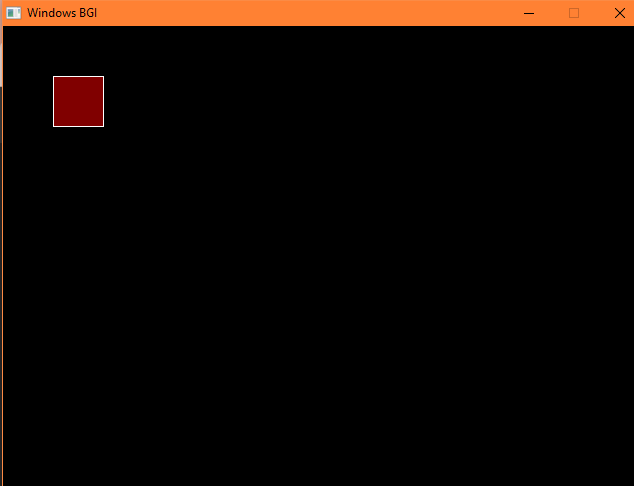

Algorithm:

4-connected approach:
1. We can implement flood fill algorithm by using recursion.
2. First all the pixels should be reassigned to common color. here common color is black.
3. Start with a point inside given object, check the following condition:
if(getpixel(x,y)==old_col)---old_col is common color
4. If above condition is satisfied, then following 4 steps are followed in filling the object.
//Recursive 4-way floodfill.
putpixel(x,y,fill_col);
flood(x+1,y,fill_col,old_col);
flood(x-1,y,fill_col,old_col);
flood(x,y+1,fill_col,old_col);
flood(x,y-1,fill_col,old_col);

Output:

8-connected approach:
1. We can implement flood fill algorithm by using recursion.
2. First all the pixels should be reassigned to common color. here common color is black.
3. Start with a point inside given object, check the following condition:
if(getpixel(x,y)==old_col)---old_col is common color
4. If above condition is satisfied, then following 8 steps are followed in filling the object.
//Recursive 4-way floodfill.
putpixel(x,y,fill_col);
flood(x+1,y,fill_col,old_col);
flood(x-1,y,fill_col,old_col);
flood(x,y+1,fill_col,old_col);
flood(x,y-1,fill_col,old_col);
flood(x + 1, y - 1, fill_col, old_col);
flood(x + 1, y + 1, fill_col, old_col);
flood(x - 1, y - 1, fill_col, old_col);
flood(x - 1, y + 1, fill_col, old_col);

Output:

Conclusion:
In this lab, we successfully implemented the Flood Fill Algorithm using C++ and the graphics library. The program demonstrates how a specific region can be filled with a selected color starting from a seed point. By applying recursive calls in 4-directional and 8-directional connectivity, we understood how neighboring pixels are checked and filled based on color conditions.

