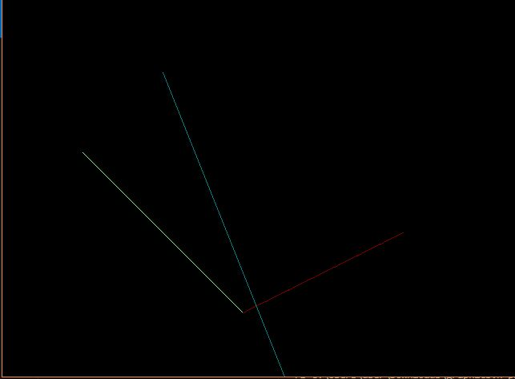

LAB-1
TITLE: Introduction to Computer Graphics and basic drwaing using C

OBJECTIVES : 
1. To understand the basic structure of a graphics program in C
2.To draw basic shapes (pixel, line,rectangle, circle) using C graphic functions.

THEORY:
Graphics Mode Initialization:
Computer graphics in C requires:
• Initializing graphics driver
• Initializing graphics mode
• Specifying the directory of BGI files (or using current folder)
• The coordinate system begins at:
• (0,0) = top-left corner of the screen
• Coordinates increase:
• +x → right
• +y → downward 

Basic drawing functions in c
1.putpixel(x,y,color)
Draws a single pixel at (x,y) with specified color (0-15). Only putpixel() accepts color
directly.
2. line(x1, y1, x2, y2)
Draws a straight line between (x1, y1) and (x2, y2). Color must be set with setcolor().
3. rectangle(left, top, right, bottom)
Draws an outline of a rectangle. Color must be set with setcolor().
4. circle(x, y, r)
Draws a circle with center (x, y) and radius r. Color set by setcolor().
5. setcolor(color)
Sets the drawing color for lines, rectangles, circles, etc. Color names must be in CAPITAL
letters or use integer codes 0-15.
6. setbkcolor(color)
Sets the background color.
7. closegraph()
Closes the graphics mode.git

OUTPUT:

CONCLUSION:
Hence, we understood the concept of basic structure of a graphics program in c. We learnt how to setup and initialize the graphics mode. 
We also drew some baic shapes like pixel, line, triangle rectangle uing C graphic functions.
