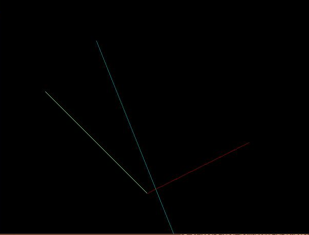

LAB-1
TITLE: Introduction to Computer Graphics and basic drwaing using C

OBJECTIVES : 
1. To understand the basic structure of a graphics program in C
2.To draw basic shapes (pixel, line,rectangle, circle) using C graphic functions.

OUTPUT:

CONCLUSION:
Hence, we understood the concept of basic structure of a graphics program in c. We learnt how to setup and initialize the graphics mode. 
We also drew some baic shapes like pixel, line, triangle rectangle uing C graphic functions.
